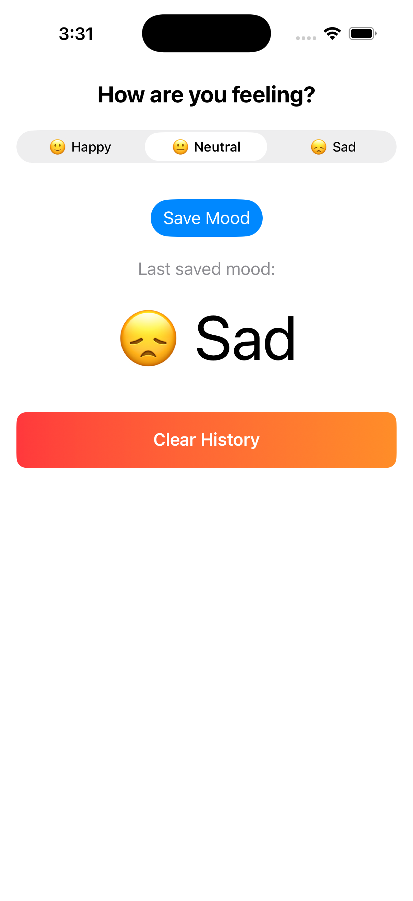

# Mood Tracker 🧠✨

Track your daily moods with a simple, offline-friendly iOS app built in SwiftUI.

## About
This app allows users to select and save their mood for the day, view their mood history, and track it over time. Data is stored locally using UserDefaults, making it fast and offline-friendly.

## Features
- Select and save your daily mood
- View last saved mood with emoji
- Mood history with timestamps
- Persistent local storage using UserDefaults
- Clean MVVM architecture
- Modern SwiftUI UI with cards and gradient colors

## Tech Stack
- Swift
- SwiftUI
- Combine
- MVVM Architecture

## Screenshot

## Author
Taher
